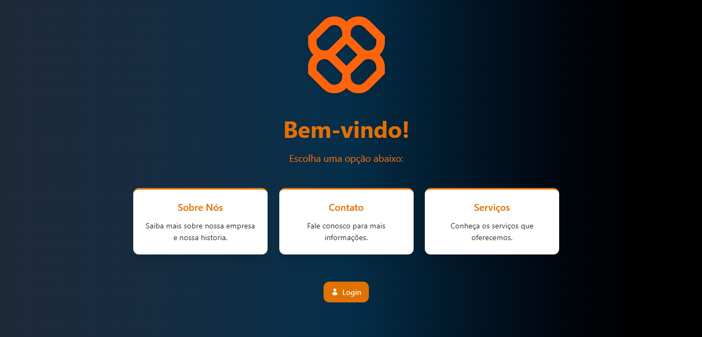

# Projeto Telas

## :desktop_computer: Project

Training project, consisting of several screens containing different paths and functionalities from each other.

## : Technologies

⚡ Vue - Framework

🖥 JavaScript – Dynamic frontend logic

🎨 Tailwind CSS - Fast and efficient styling

🖥 Vite - Rapid development tool

🔥 Node.js e npm - Package Manager

